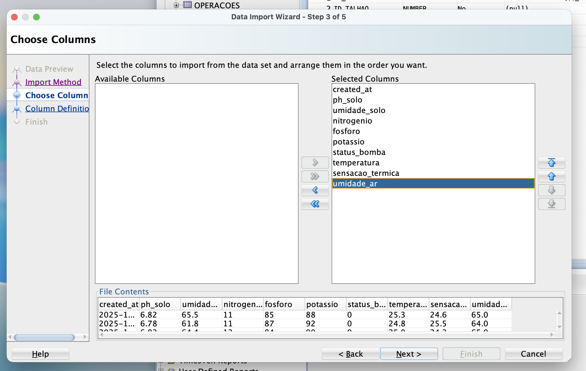
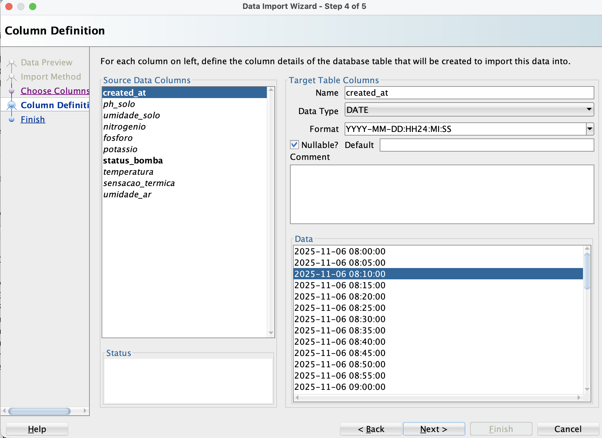
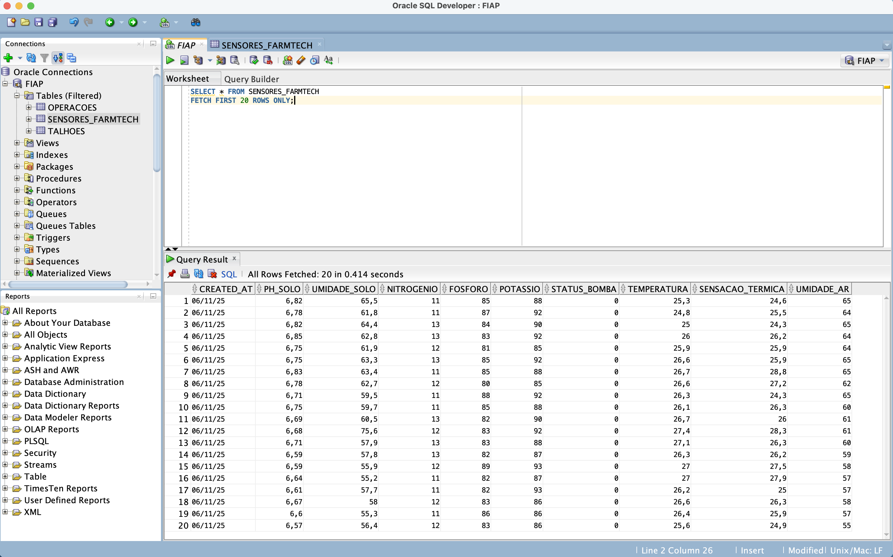
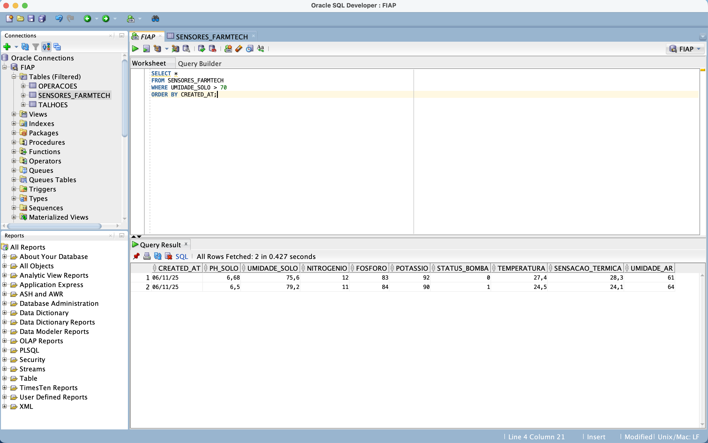
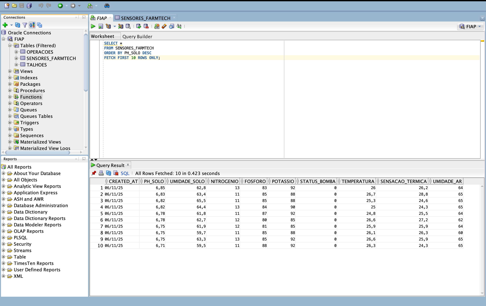
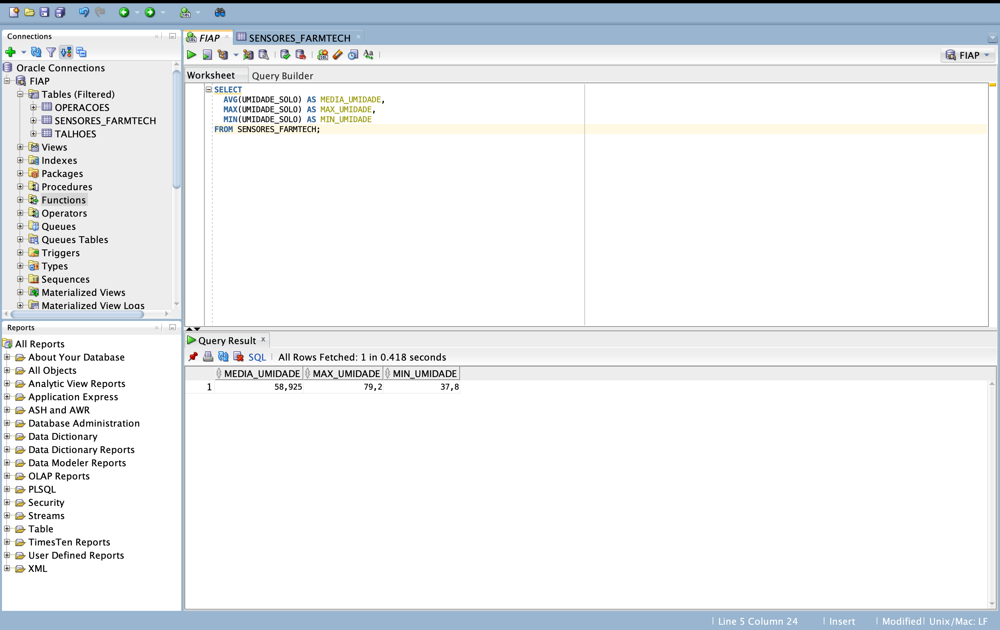

# Fase 3 — Banco de Dados Oracle (FarmTech Solutions)

## Contexto e Objetivo
Nesta etapa do projeto **FarmTech Solutions**, o foco foi trabalhar com um **banco de dados Oracle** para armazenar e analisar as informações coletadas pelos sensores agrícolas.  
O trabalho teve como objetivos principais:

1. **Estruturar** uma tabela relacional no Oracle para organizar as leituras dos sensores;  
2. **Importar** o arquivo de dados gerado na Fase 2 (arquivo CSV com as medições simuladas);  
3. **Executar consultas SQL** demonstrando seleção, filtragem, ordenação e funções estatísticas básicas (AVG, MAX, MIN);  
4. **Documentar** todas as etapas, incluindo prints do processo e resultados obtidos.

Essas ações permitiram compreender melhor os dados capturados e preparar a base para futuras análises com foco em automação e inteligência artificial no agronegócio.

## Equipe 
- João Rafael Gonçalves Ramos  
- Letícia Angelim Guerra  
- Matheus Guimarães França  
- Rivando Bezerra Cavalcanti Neto  
- Tales Ferraz de Arruda Domienikan  

## Conjunto de Dados
Arquivo: `data/dados_sensores.csv`  
Período coberto: **06/11/2025 08:00 → 06/11/2025 11:55**  
Intervalo entre leituras: **5 minutos**  
Duração total da simulação: **4 horas**  
Total de leituras: **48**

Variáveis principais (amostra):
- `created_at` (timestamp da leitura)  
- `ph_solo`, `umidade_solo`, `temperatura`, `sensacao_termica`, `umidade_ar`  
- `nitrogenio`, `fosforo`, `potassio`  
- `status_bomba` (indicador 0/1)

### Faixas e justificativas dos valores simulados
- **pH do solo (~6,3–6,9)**: intervalo ótimo para a maioria das culturas, favorecendo disponibilidade de nutrientes.
- **Umidade do solo (≈55%–80%)**: faixa típica próxima à capacidade de campo; valores acima de 70% indicam solo úmido onde irrigação tende a ficar desligada.
- **Temperatura (≈24–27 °C)** e **umidade do ar (≈55%–65%)**: condições coerentes com uma manhã amena.
- **Nitrogênio (≈11–13), Fósforo (≈80–86), Potássio (≈85–93)**: índices estáveis de um talhão previamente adubado.
- **Status da bomba (0/1)**: regra de exemplo para automação — liga quando `UMIDADE_SOLO` cai (ex.: <60) e desliga quando sobe (ex.: >70).

## Esquema Relacional
Foi criada no Oracle uma tabela chamada `SENSORES_FARMTECH` com os seguintes campos:

```sql
CREATE TABLE SENSORES_FARMTECH (
  CREATED_AT        TIMESTAMP,
  PH_SOLO           NUMBER(4,2),
  UMIDADE_SOLO      NUMBER(5,1),
  NITROGENIO        NUMBER(5,0),
  FOSFORO           NUMBER(5,0),
  POTASSIO          NUMBER(5,0),
  STATUS_BOMBA      NUMBER(1,0),
  TEMPERATURA       NUMBER(4,1),
  SENSACAO_TERMICA  NUMBER(4,1),
  UMIDADE_AR        NUMBER(4,1)
);
```
Justificativas dos tipos:
- `TIMESTAMP` em `CREATED_AT` preserva data e hora com precisão para séries temporais.
- `NUMBER(p,s)` reflete a precisão prática das leituras (ex.: `PH_SOLO` com duas casas e `UMIDADE_SOLO` com uma).
- Inteiros para indicadores como `STATUS_BOMBA` simplificam filtros e agregações.

## Etapas Realizadas
1. Criação da tabela `SENSORES_FARMTECH` no Oracle SQL Developer.  
2. Importação do arquivo CSV com o assistente Import Data.  
3. Execução das consultas SQL listadas a seguir para análise dos dados.  
4. Registro dos prints de tela das etapas no diretório /docs.

> Todos os prints do processo (importação, consultas e resultados) estão salvos na pasta docs.

## Consultas SQL Executadas
###  Consulta 1 — Verificação de importação:
```sql
SELECT * FROM SENSORES_FARMTECH
FETCH FIRST 20 ROWS ONLY;
```
Por que usar: checagem rápida das primeiras linhas para validar estrutura e dados importados.

###  Consulta 2 — Filtragem por umidade >70:
```sql
SELECT *
FROM SENSORES_FARMTECH
WHERE UMIDADE_SOLO > 70
ORDER BY CREATED_AT;
```
Por que usar: acima de 70% indica solo úmido; útil para confirmar períodos em que a irrigação tenderia a ficar desligada, observando a evolução temporal.
###  Consulta 3 — Ordenação (top 10 maiores valores de pH):
```sql
SELECT *
FROM SENSORES_FARMTECH
ORDER BY PH_SOLO DESC
FETCH FIRST 10 ROWS ONLY;
```
Por que usar: extremos de pH ajudam a identificar possíveis riscos de indisponibilidade de nutrientes e necessidades de correção (calagem).
###  Consulta 4 — Cálculo de médias e extremos:
```sql
SELECT
  ROUND(AVG(UMIDADE_SOLO), 2) AS MEDIA_UMIDADE,
  MAX(UMIDADE_SOLO) AS MAX_UMIDADE,
  MIN(UMIDADE_SOLO) AS MIN_UMIDADE
FROM SENSORES_FARMTECH;
```
Por que usar: sumariza o comportamento das variáveis; mínimos e máximos mostram limites observados enquanto as médias servem de referência operacional.

## Resultados Obtidos

A consulta de estatísticas (AVG, MAX e MIN) sobre a variável **UMIDADE_SOLO** retornou os seguintes valores:

- **Média da umidade do solo:** 58,93 %
- **Máxima registrada:** 79,2 %
- **Mínima registrada:** 37,8 %

Esses resultados mostram a variação da umidade do solo durante o período de coleta.  
Valores abaixo de 60% indicam momentos em que a irrigação tende a ser acionada,  
enquanto valores acima de 70% indicam solo úmido e bomba desligada.

## Evidências (prints)
Importação de dados (Assistente do Oracle SQL Developer):



Etapa do assistente (Choose Columns). Selecionamos quais colunas do CSV serão importadas e a ordem final na tabela. A lista da direita mostra as colunas escolhidas; as setas permitem reordenar. O preview inferior confirma nomes e amostras dos dados, evitando troca de posição ou falta de colunas.



Etapa do assistente (Column Definition). Para cada coluna da tabela foram definidos qual seria o tipo ideal para armazenar o dado e se ele poderia ser NULLABLE, ou se teria algum outro tipo de restrição.


Confirmação de que a carga foi concluída e o `COMMIT` realizado. Após essa mensagem, os registros já podem ser consultados na tabela `SENSORES_FARMTECH`.

Consultas SQL e resultados:



Uso de `SELECT *` com `FETCH FIRST 20 ROWS ONLY` para validar rapidamente a estrutura das colunas, os tipos e uma amostra das linhas importadas.



Consulta com `WHERE UMIDADE_SOLO > 70` ordenada por `CREATED_AT`. Serve para inspecionar períodos em que o solo esteve mais úmido (regra de automação: bomba tende a permanecer desligada nessa faixa).



Ordenação decrescente por `PH_SOLO` e limitação do resultado (top 10). Útil para localizar leituras com pH mais alto e avaliar riscos de indisponibilidade de nutrientes e possíveis correções.



Agregações para síntese dos dados: médias e extremos (MIN/MAX). Utilizamos `ROUND` para duas casas em variáveis contínuas, obtendo indicadores que resumem o comportamento do período monitorado.
## Vídeo de Apresentação
O vídeomostra a estrutura do repositório, o processo de importação no Oracle e as consultas sendo executadas.

## Programa Ir Além 1 - Dashboard em Python
🔗 [LINK DO VÍDEO] (https://youtu.be/J9iB4t9So8U)

## Estrutura do Projeto
```
/
 ┣ data/  → dados_sensores.csv
 ┣ docs/  → prints do SQL Developer
 ┣ src/   → consultas.sql (DDL + consultas)
 └ README.md
```
